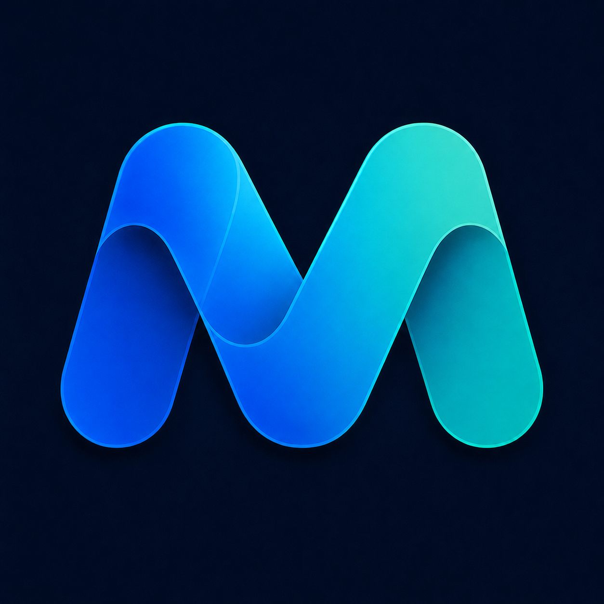

<p align="center">
  
</p>

<h1 align="center">Mimi</h1>

<p align="center">
  MacとChromeで、ライブ翻訳音声を聞く
</p>

Mimi は、Mac 上でライブ翻訳音声を聞くための local-first プロジェクト
です。1つの source repository に次の3製品を収録しています。

- **Mimi for Chrome**: Start を押した後だけ現在のタブ音声を扱う Chrome 拡張。
- **Mimi Setup for Chrome**: local server、Keychain、Chrome native messaging の
  セットアップを補助する Mac 側の helper/native host。
- **Mimi for Mac**: Mac の選択した音声を取得し、翻訳音声を再生する Swift app。

V1 は live stream に限定しています。字幕、動画ダウンロード、完成動画の
書き出し、オフライン再生、翻訳音声キャッシュ、transcript や raw audio の
保存は行いません。

## Release status

Mimi for Chrome **0.1.2** は
[Chrome Web Store](https://chromewebstore.google.com/detail/mimi/oknekoaclmnljnlpmffphpiflcdeibgg)
から誰でもインストールできます。この repository には次の **0.1.3 source
candidate** がありますが、extension 0.1.3 はまだ Store へ upload、review、
publish されていません。

Chrome helper の **Mimi Setup for Chrome 0.1.2** は
[Developer ID署名・Apple notarization済みZIP](https://github.com/AkiGarage/mimi/releases/download/v0.1.2/Mimi-0.1.2-macOS-notarized.zip)
として公開しています。[SHA-256 checksum](https://github.com/AkiGarage/mimi/releases/download/v0.1.2/Mimi-0.1.2-macOS-notarized.zip.sha256)
も同じReleaseにあります。ZIPを展開して `Mimi.app` をApplicationsへ移動し、
一度起動してからMimi Setupの案内に従い、Chrome native helperのinstallと
provider keyのmacOS Keychain保存を行ってください。

別製品の **Mimi for Mac** は引き続きsource/developer buildです。実機での聴感、
権限、sleep/wake、VoiceOver、長時間動作の確認はまだ限定的です。

## Privacy と BYOK

BYOK (Bring Your Own Key) 方式です。Gemini と OpenAI の API key は Mac 側で
設定します。Chrome extension は key を保存しません。通常の setup では設定した
key を macOS Keychain に保存し、`.env.example` には名前だけを記載します。実際の
`.env` はローカルに置き、Git へ commit しないでください。

Listening 中は Chrome extension から local Mimi server へタブ音声を送り、
local server はユーザーが明示的に選択した provider、Gemini Live Translate
(Google) または GPT Realtime (OpenAI) にだけ live stream を送ります。選択した
provider の現行 terms、data handling と retention、利用制限、料金が適用されます。
広告 tracking や自動診断 upload はありません。key、transcript、private URL、個人
データを issue、log、screenshot、pull request に含めないでください。
[SECURITY.md](SECURITY.md) と [privacy policy](docs/product/privacy-policy.md)
も確認してください。

内部の native-host path や runtime settings には互換性のため `jp-dub` という
文字列が残っています。これは protocol compatibility のための名前であり、
private repository の公開を意味しません。

## Fresh clone の build と test

macOS の Node.js LTS と Swift toolchain を使ってください。次のコマンドは
実際の Gemini、Chrome、Keychain flow を実行しません。

```bash
(cd apps/mac/local-server && npm ci --ignore-scripts && npm run check && npm test)
(cd apps/mac/extension && npm run check && npm test)
(cd apps/mac/native-host && npm run check && npm test)
swift test --package-path apps/mac/MimiApp
swift test --package-path apps/mac/MimiForMac
MIMI_SETUP_TEST_MODE=1 /bin/zsh "apps/mac/setup/Mimi Setup.command"
node --test scripts/test/mimi-product-identity.test.cjs
node --test scripts/test/package-chrome-extension.test.cjs
node scripts/package-chrome-extension.cjs --out="$PWD/tmp/chrome-package"
node scripts/package-mimi-app.cjs \\
  --node="$(command -v node)" \\
  --dist="$PWD/tmp/mimi-app-package"
```

Packaging は ignored な local output に unsigned developer app を作ります。
runtime download、Developer ID signing、notarization、Store upload は行いません。

Issue や変更を送る場合は [CONTRIBUTING.md](CONTRIBUTING.md) と
[SECURITY.md](SECURITY.md) を確認し、generated output、credential、raw audio、
private な運用記録を Git に入れないでください。

英語版は [README.md](README.md) です。
